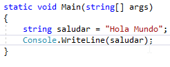
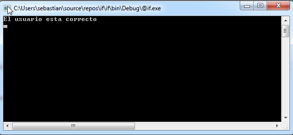
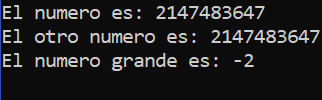
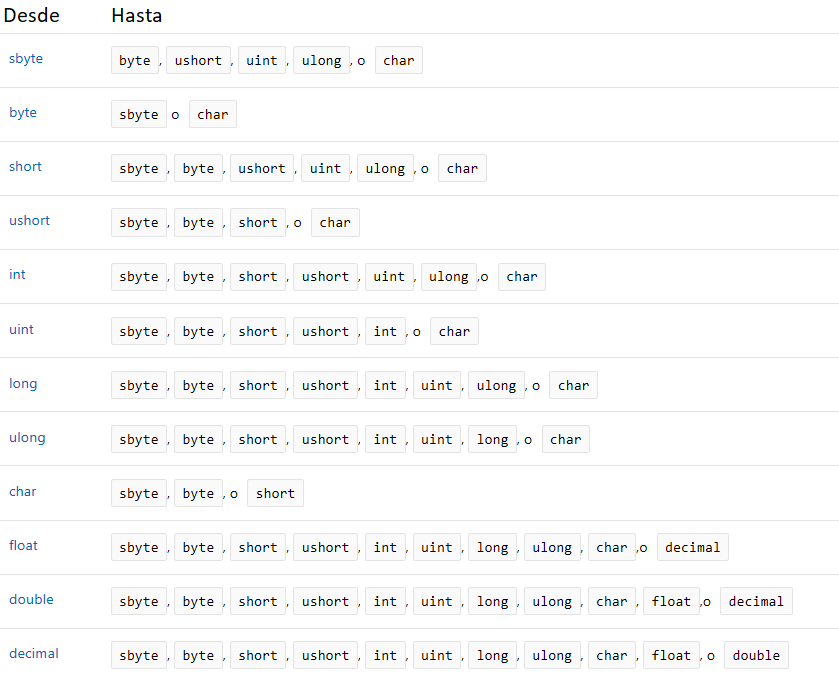

# Introducción a C\

A continuación, veremos acciones y líneas de instrucciones que se
repetirán a lo largo de los ejemplos.

## Iniciar un nuevo proyecto de Consola

En este primer ejemplo aplicaremos los conceptos aprendidos
anteriormente realizando el clásico ejemplo \"Hola Mundo\". Siendo
nuestro primer ejemplo, debe ser sencillo y por lo tanto se apoyará en
lo que se llama "consola", es decir, mostrando texto simple por
pantalla.

1. Abrimos Visual Estudio 2017

2. Seleccionamos File-\>New-\>Project


3. Nos abrirá una nueva pantalla


4. Seleccionamos la opción \"ConsoleApp(.NET Framework) \".

5. Aquí escribimos el nombre de proyecto.

6. Nos muestra donde se guardara el proyecto.

7. Por defecto Visual studio le dará el mismo nombre que el campo
   
   \"Name\".

8. Le damos \"OK\" para que comience a crear el proyecto. Nos saldrá
   
   este cuadro que mostrará el progreso de creación de proyecto.


9. En esta sección se editará el código C Sharp.

10. Aquí se muestran los archivos del programa.


Más adelante veremos los conceptos de *librería*, *namespace*, *clase*,
*función*, pero primero vamos a ver en dónde se ubican cada uno de estos
elementos.

**Aquí están las librerías**


**Aquí están los namespaces**

El de nuestro proyecto tomará el nombre que le dimos al crearlo, que en
este caso es \"ConsoleApp1\".Dentro de las llaves irá más código.


Dentro de las llaves del namespace irá la clase que por defecto toma el
nombre de \"Program\"


Dentro del class irá una función y dentro de ésta se escribe el código
c\#.


## Cómo Compilar un Proyecto

Cada vez que terminamos de escribir nuestro código tenemos que compilar.
Esta operación se repite cada vez que queremos ver el resultado de
nuestro proyecto.

a.  Vamos a guardar el programa File **-\>** SaveProgram.cs


b.  Vamos a compilar el programa: Build **-\>** BuildSolution

> 

Se nos abrirá este cuadro de dialogo en donde nos mostrará el progreso
de compilación. Está ubicado debajo de la sección de editar código.


## Código que reutilizaremos

Las siguientes líneas de código las utilizaremos a lo largo de los
ejemplos:

**Console.WriteLine(\"Press any key\");**

Imprimirá un texto en la pantalla que es siguiente: \"Press any key \"

**Console.ReadKey();**

Detendrá el programa hasta que presionemos una tecla

**Console.Read();**

Detendrá el programa hasta que presionemos la tecla
Enter


**Console.ReadLine();**

Detendrá el programa hasta que presionemos la tecla
Enter


Su diferencia con respecto a "**Console.Read()**" está en la forma en que entrega al programador lo ingresado por el  usuario antes de la tecla Enter. A  efecto de este curso, nos basta con saber que cuando necesitemos obtener el texto ingresado por el usuario, usaremos **Console.ReadLine()** y no **Console.Read()**. Cuando no necesitemos el texto del usuario, utilicemos preferentemente **Console.ReadKey()** dado que sucesivos usos de **Console.Read()**
pueden dar lugar a que "saltee" uno de ellos.

Si queremos comprobarlo podemos comparar el comportamiento de estas dos
porciones de código en un proyecto de consola:

```csharp

Console.WriteLine("1");
Console.ReadKey();
Console.WriteLine("2");
Console.ReadKey();
Console.WriteLine("3");
Console.ReadKey();
```

```csharp

Console.WriteLine("1");
Console.Read();
Console.WriteLine("2");
Console.Read();
Console.WriteLine("3");
Console.Read();
```

Para más detalles, podemos referirnos a:

[[https://social.msdn.microsoft.com/Forums/en-US/5515c215-6701-4a05-ba0a-9cd63ef206df/difference-between-readreadline-and-readkey-in-c?forum=csharpgeneral]{.underline}](https://social.msdn.microsoft.com/Forums/en-US/5515c215-6701-4a05-ba0a-9cd63ef206df/difference-between-readreadline-and-readkey-in-c?forum=csharpgeneral)

## Comentarios

En la programación de computadoras, un comentario es una construcción
del lenguaje de programación que:

- Está destinada a incrustar anotaciones legibles al programador en el código fuente de un Programa informático.

- Se arma con anotaciones potencialmente significativas para los programadores, pero que deben ser ignoradas por los compiladores e intérpretes.

- Es añadida usualmente con el propósito de hacer el código fuente más fácil de entender con vistas a su mantenimiento o reutilización.

- Tienen una forma de escribirla (sintaxis y reglas) que varían entre lenguajes. En C\# Los comentarios comienzan // para que valga sólo para línea actual, o con /\* para que valga hasta que se indique lo contrario con \*/. Los entornos de programación suelen ayudarnos cambiando el color de las partes que han quedado \"comentadas\".

Escribimos dos comentarios: un de una sola línea y uno multilínea


La siguiente línea **Console.ReadKey();**detendrá el programa hasta que
presionemos un tecla


Luego compilamos nuestro proyecto y como resultado nos mostrara consola sin ningún texto. El programa quedará en espera hasta que presionemos una tecla, debido a la instrucción **Console.ReadKey()** que le hemos incorporado:


## Definición de variable

En programación, las variables son espacios reservados en la memoria que, como su nombre indica, pueden cambiar de contenido a lo largo de la ejecución de un programa. Una variable corresponde a un área reservada en la memoria principal del ordenador.

## Tipos de Datos Básicos

A las variables hay que indicarles previamente qué tipo de valor almacenará.

Los tipos de datos básicos son:


Primero crearemos una variable de tipo **string** llamada **saludar** con texto almacenado **hola mundo**.

```csharp
  string saludar = "Hola Mundo";
```

Una vez agregado se ve así:


La siguiente línea **Console.WriteLine(saludar); ,** imprimirá el
contenido de la variable **saludar**



Por último agregamos estas dos líneas de código.Ya fue explicado cuál es
función de cada una.


**Resultado del programa**


## Concatenación

La concatenación en la unión de dos textos, utilizando el signo de suma
+. Cuando se guardan números enteros en una variable se utiliza tipo de
datos **Int.**


El texto que queremos que se imprima va entre comillas seguido del signo
de concatenación que es el + y por último la variable.


Por último, agregamos las dos últimas líneas de código, cuyo uso ya
explicamos anteriormente.


Así se vería:


## Caracteres especiales para armado de textos

Si necesitáramos armar un texto de más de una línea, podemos agregar una
bajada de línea incorporando la combinación \\n. Para incorporar una
tabulación podemos utilizar \\t. Siempre deben estar entre comillas.

```csharp
Console.WriteLine(\"Cartel con bajada de línea\\ny
ta\\tbu\\tla\\tciones\");

Console.ReadKey();
```


## Definición de Constante

Las constantes son valores (numéricos, cadenas de texto, etc.) que no
serán modificados durante el funcionamiento de la aplicación.

1. La palabra **const** indica que es una constante, **double**es el
   
   tipo de valor que almacenará y **Pi** es el nombre que le daremos en
   
   este caso.


2. En la siguiente imagen tenemos dos nuevas línea de código. La
   
   primera **Console.WriteLine(\"El valor de Pi es: \" + Pi);**

Imprimirá el texto \"**El valor de Pi es:**\" y luego lo concatenamos
con el valor de la variable **Pi.**

La segunda línea **Console.ReadKey();** detendrá la ejecución hasta que
se presione una tecla.


3. 3)Así se verá el resultado en consola.


## Operaciones Matemáticas

Las operaciones matemáticas utilizan los siguientes operadores:


Primero crearemos dos variables de tipo **int**


Se crea una variable de tipo **Int** para que almacene la operación
matemática, llamada suma.


Le agregamos las siguientes líneas


Así se verá el resultado :


## Estructuras de Control: Condiciones

Las estructuras condicionales nos permiten ejecutar una serie de instrucciones si se cumple una determinada condición que nosotros le indiquemos. Es importante recordar que la condicióndebe dar un resultado booleano (es decir, verdadero o falso). Tenemos varios tipos de estructuras condicionales, que iremos desarrollando en este documento.

**Definición De Operador de Comparación**

Los operadores se utilizan para comparar dos valores que pueden ser numéricos, texto, etc.


**If simple (sólo acciones para verdadero):** indicamos una condición al programa para que evalúe primero si es verdadera o falsa. Sólo si ésta es verdadera se ejecutan las instrucciones que le indicamos entre las llaves. Se suele traducir como "Si se cumple esta condición haz esto".

Creamos un variable llamada user que almacenara el nombre de usuario:

```
  string user = \"sebastian\";
```


Creamos un if; primero va el dato que vamos a comparar con otro.

Luego va el tipo de operador (en este caso utilizaremos el de igualdad),  y por último el dato con el que va a ser comparado:

```csharp
 if (user == \"sebastian\")

 {

 //Código Aquí

}
```


Ahora incluiremos las siguientes dos líneas:

```
Console.WriteLine(\"El usuario esta correcto\");

Console.Read();
```


El resultado del programa es así: {.underline}



**if -- else:** es similar al anterior, sólo que después de cerrarse la llave de if, se añade else sin indicarle ninguna condición. Esto indica que si la condición del if no es verdadera, ejecute las instrucciones que estarán dentro de else. Se suele traducir como "Si se cumple esta condición haz esto y sino haz esto otro".

Agregamos las siguientes líneas de código:

```
else

{

}
```


Le agregamos un mensaje de salida por consola:

```

  Console.WriteLine(\"usuario no encontrado\");
```


El resultado del programa es el siguiente:{.underline}


**if -elseif:** esta estructura puede entenderse una mezcla de los anteriores.Esto nos permite que si no se cumple la condición podamos indicar otra condición para hacerlo aún mas especifico. Se suele traducir como "Si se cumple esta condición haz esto y sinoes así, pero sese cumple esta condición haz esto otro".

Primero modificamos el nombre de la variable **user** por **admin**

```

String user = \"admin\";
```

Luego, creamos el elseif

```csharp
elseif (user == \"admin\")

{

}
```


Agregamos la siguiente línea

```csharp

Console.WriteLine(\"El usuario esta correcto. Hola ADMIN\");
```


[El resultado del programa es el siguiente:]{.underline}

{width="5.90625in" height="1.03125in"}

## Operadores Lógicos

Ej. "Si el sueldo es mayor a 60000, o si es mayor a 4000 y tiene el beneficio de trabajo remoto".

Los operadores lógicos nos permiten combinar más de una expresión, de modo que se evalúe si es verdadera o falsa como un todo.

Los operadores lógicos principales son "&&" (y) y "\\" (o inclusivo). El comportamiento es el siguiente:

Operador &&

| **Expresión 1** | **Expresión 2** | **Resultado** |
| --------------- | --------------- | ------------- |
| Verdadero       | Verdadero       | Verdadero     |
| Verdadero       | Falso           | Falso         |
| Falso           | Verdadero       | Falso         |
| Falso           | Falso           | Falso         |

Operador \\

| **Expresión 1** | **Expresión 2** | **Resultado** |
| --------------- | --------------- | ------------- |
| Verdadero       | Verdadero       | Verdadero     |
| Verdadero       | Falso           | Verdadero     |
| Falso           | Verdadero       | Verdadero     |
| Falso           | Falso           | Falso         |

Con el operador \\, si la primera expresión es verdadera, C\# no evalúa la segunda.

Se pueden combinar más de 2 expresiones. Tengamos en cuenta la asociación, donde se evalúan primero las combinaciones && y luego las \\.

Si tenemos:

Expresión1 \\ Expresión2 && Expresión 3

Donde: Expresión1: Verdadero

Expresión2: Verdadero

Expresión 3: Falso

Entonces C\# evalúa primero:

"Expresión2 && Expresión 3": Verdadero y Falso = Falso y luego se evaluará Expresión1: Verdadero y el su resultado anterior (Falso) = Verdadero.

Podemos alterar esta asociación agregando paréntesis:

( Expresión1 \\ Expresión2 ) && Expresión 3

Se puede comprobar con este código:

```csharp

bool Expresion1 = true;

bool Expresion2 = true;

bool Expresion3 = false;

if (Expresion1 \\ Expresion2 && Expresion3)

{

Console.WriteLine(\"Resulta Verdadero\");

} else

{

Console.WriteLine(\"Resulta Falso\");

}

Console.WriteLine(\"Presione una tecla para salir\");

Console.ReadKey();
```

Y luego agregando los paréntesis:

```
 bool Expresion1 = true;                               

 bool Expresion2 = true;                               

 bool Expresion3 = false;                              

 if ((Expresion1 \\ Expresion2) && Expresion3)       

 {                                                     

 Console.WriteLine(\"Resulta Verdadero\");             

 } else                                                

 {                                                     

 Console.WriteLine(\"Resulta Falso\");                 

 }                                                     

 Console.WriteLine(\"Presione una tecla para salir\"); 

 Console.ReadKey();                                    
```

**Condición múltiple**

Switch (o también llamada Case según el lenguaje), es una estructura de control empleada en programación. Se utiliza para agilizar la toma de decisiones múltiples; trabaja de la misma manera que lo harían sucesivos if ,o ifelse, así como combinaciones propias de determinados lenguajes de programación

Primero crearemos las siguientes variables que a utilizaremos a lo largo del programa.

Las variables A y B almacenan los números que se utilizaran en operación matemática elegida

```
 int a = 6; 

 int b = 9; 
```

La variable resultada tendrá una valor por defecto de 0, esta guardará el resultado de la operación matemática

```
  int resultado = 0;
```

La siguiente variable (llamada "valor") almacenará un valor proporcionado por el usuario del programa

```
  string valor = \"\";
```

La variable opción almacenara la siguiente línea de código


Estas líneas de código imprimirán es texto que contienes

```
 Console.WriteLine(\"1- Suma \");                    

 Console.WriteLine(\"2- Resta \");                   

 Console.WriteLine(\"que operacion desea hacer: \"); 
```

La variable valor almacena una línea de código que captura el numero proporcionado por usuario

```
  valor = Console.ReadLine();
```

Esta última línea lo convierte en un entero y el resultado lo almacena en la variable opción


En el Switch la variable es comparada con el número de caso, en este caso hay dos y un valor por defecto

```
 switch (variable) 

 {                 

 case 1:           

 //código Aquí     

 case 2:           

 //código Aquí     

 default:          

 //código Aquí     

 }                 
```

El primero como el segundo case del switch tendrá la variable resultado que almacenara la operación matemática y la instrucción break sale del switch una vez que se allá llegado al final de código

```
 switch (opcion)    

 {                  

 case 1:            

 resultado = a + b; 

 break;             

 case 2:            

 resultado = a - b; 

 break;             

 }                  
```

En la opción default si los casos anteriores para comparar son falso tomara por defecto es opción

```
 switch (opcion)                            

 {                                          

 case 1:                                    

 resultado = a + b;                         

 break;                                     

 case 2:                                    

 resultado = a - b;                         

 break;                                     

 default:                                   

 Console.WriteLine(\"Opcion no Validad \"); 

 break;                                     

 }                                          
```


En esta línea de código imprimirá el texto y la variable **resultado**

```
  Console.WriteLine(\"El resultado es: \" + resultado);
```

Añadimos luego estas líneas de código, de las cuales ya vimos su función

```
 Console.WriteLine(\"Press any key\"); 

 Console.Read();                       
```


[Así se verá el resultado]{.underline}


## Estructuras de Control: Repeticiones

### Bucle For

Este tipo de estructura de repetición (o "bucle") ejecuta una instrucción o un bloque de instrucciones mientras se evalúa una expresión booleana específica como verdadera:


Primero crearemos un variable de tipo int, que no almacenará un dato por ahora.

```
  int n;
```

1. En el Inicializador va la variable que creamos anteriormente con un numero"de inicio" que le demos.

2. La condición seráevaluada para verificar si es verdadera (en este casosi la variable "n" es mayor a 10). Cuandono sea menor a 10 resultará falsa, momento en que dejará de repetir la ejecución del código que contiene entre las llaves. Los Signos que se utilizan en la condición son(\<, \> ,=, \>=, =\< )

3. se utiliza para sumarle o restarle uno al valor que almacena la variable
- n++: se suma una unidad después de la ejecución

- n\--: le resta una unidad después de la ejecución

- 

```
 for ( n=1; n \< 10 ; n++) 

 {                         

 }                         
```


En esta línea de código imprimirá la variable N

```
  Console.WriteLine(n);
```

En esta otra línea de código se detendrá hasta que presiones una tecla.

```
  Console.Read();
```


### Bucle while

Es una estructura repetitiva que permite ejecutar una instrucción o un conjunto de instrucciones varias veces.

Primero creamos una variable de tipo INT con un valor inicial 0.

```
  int n = 0;
```

Ahora crearemos un bucle While, dentro de los paréntesis va primero la variable, y luego el operador de comparación (que son\<, \> ,=, \>=, =\< ). En este caso utilizaremos que sea mayor a 10.

Cuando sea N mayor a 10 se detendrá en Bucle

```
 while (n \< 10) 

 {               

 //Código Aquí   

 }               
```

Agregamos las siguientes líneas de código dentro del bucle While.

La primera Imprimirá la variable N y la segunda le sumará 1 al número que imprimió en la pantalla

```
 Console.WriteLine(n); 

 n++;                  
```

Nos quedará así:


Por último, agregamos estas dos líneas que ya vimos:

```
 Console.WriteLine(\"Press any key\"); 

 Console.Read();                       
```


[El resultado del programa]{.underline}


### Bucle do - while

A diferencia de los bucles anteriores, este tipo de bucle tiene la condición para evaluar la repetición o la salida al final, luego de las acciones que se pueden repetir. Por esta razón, la particularidad de este tipo de bucles es que siempre se van a ejecutar al menos una vez. Se escriben de esta forma:

```
 do                                       

 {                                        

 //acciones para repetir                  

 } while (/\*condición para repetir \*/); 
```

Un ejemplo del mismo es el siguiente:

```
 string cartel = \"\";                                   

 int fila = 0;                                           

 cartel = \"Número \\t Texto \\n\";                      

 do                                                      

 {                                                       

 fila = fila + 1;                                        

 cartel = cartel + fila + \"\\t Fila \" + fila +\"\\n\"; 

 } while (fila \< 10);                                   

 Console.WriteLine(cartel);                              

 Console.ReadKey();                                      
```


## Conversiones básicas entre tipos de datos

Existen situaciones en las que necesitamos almacenar el resultado de una operación en una variable de un tipo de dato distinto a aquellos que estamos operando. Por ejemplo, puede que tengamos una sumatoria entre números donde las variables de tipo int son suficientes, pero es posible que la suma entre ambos exceda el valor máximo de una variable int, estimando posible un tipo de dato long.

Las conversiones entre ciertos tipos de datos no requieren una sintaxis especial, porque son sencillas y seguras. Éstas se llaman **conversiones implícitas**.

```
 // Conversion implicita.                                

 int num = 2147483647;                                   

 int otroNum = 2147483647;                               

 long granNum = num;                                     

 granNum = granNum + otroNum;                            

 Console.WriteLine(\"El numero es: \" + num);            

 Console.WriteLine(\"El otro numero es: \" + otroNum);   

 Console.WriteLine(\"El numero grande es: \" + granNum); 

 Console.Read();                                         
```


Veamos este otro ejemplo que parece equivalente al anterior:

```
 int num = 2147483647;                                   

 int otroNum = 2147483647;                               

 long granNum = num + otroNum;                           

 Console.WriteLine(\"El numero es: \" + num);            

 Console.WriteLine(\"El otro numero es: \" + otroNum);   

 Console.WriteLine(\"El numero grande es: \" + granNum); 

 Console.Read();                                         
```

Éste es el resultado:



El problema ocurrió en esta línea:

```
  granNum = num + otroNum;
```

Antes de guardar el resultado en granNum, el sistema supone que una suma de dos variables int también será int, y en este caso la suma excede el máximo soportado. Esto se puede solucionar fácilmente con una **conversión explícita**, es decir, donde el programador indica expresamente la conversión, en este caso escribiendo (long) antes de la expresión a convertir:

```
 // Conversion explicita.                                  

 int exNum = 2147483647;                                   

 int exOtroNum = 2147483647;                               

 long exGranNum = 0;                                       

 exGranNum = (long) exNum + exOtroNum;                     

 Console.WriteLine(\"El numero es: \" + exNum);            

 Console.WriteLine(\"El otro numero es: \" + exOtroNum);   

 Console.WriteLine(\"El numero grande es: \" + exGranNum); 

 Console.Read();                                           
```

De modo que las conversiones explícitas se escriben anteponiendo el tipo de dato de destino entre paréntesis a aquello que queremos convertir.

Si una de las variables de la suma fuera long, también hubiera funcionado sin conversión explícita:

```
 int exNum = 2147483647;                                   

 long exOtroNum = 2147483647;                              

 long exGranNum = 0;                                       

 exGranNum = exNum + exOtroNum;                            

 Console.WriteLine(\"El numero es: \" + exNum);            

 Console.WriteLine(\"El otro numero es: \" + exOtroNum);   

 Console.WriteLine(\"El numero grande es: \" + exGranNum); 

 Console.Read();                                           
```

Las conversiones implícitas de tipos de dato básicos son las siguientes:


Aquí hay una tabla de conversiones explícitas. Debemos tener en cuenta que podemos perder información según los valores de origen y el tipo de datos de destino:



Ahora bien, en C\# las conversiones que implican textos (tipos de dato String) como origen o destino son diferentes a las demás. La forma de escribirlo aquí está más impregnada de lo que es el paradigma de objetos, pero evitaremos adentrarnos en esos conceptos hasta más adelante, cuando podamos abordarlo de manera integral.

Para transformar un texto en número, debemos escribir algo como:

```
  numDeTexto = int.Parse(texto);
```

Donde en este caso numDeText es una variable int, y texto es una variable String.

Para la conversión inversa (de número a texto) utilizamos algo como lo siguiente:

```
  textoDeNum = numDeTexto.ToString();
```

Donde textoDeNum es una variable String, y numDeTexto es una variable de tipo numérico (int por ejemplo).

Aquí tenemos entonces un ejemplo con conversiones en ambos sentidos:

```
 string texto = \"111234\";                                     

 int numDeTexto;                                                

 string textoDeNum;                                             

 numDeTexto = int.Parse(texto);                                 

 textoDeNum = numDeTexto.ToString();                            

 Console.WriteLine(\"El texto es: \" + texto);                  

 Console.WriteLine(\"El numero convertido es: \" + numDeTexto); 

 Console.WriteLine(\"El texto convertido es: \" + texto);       

 Console.Read();                                                
```

{width="3.615087489063867in"
height="1.166829615048119in"}

Finalmente, tengamos en cuenta que si lo que encerramos con la instrucción int.Parse no es convertible a número, el programa terminará abruptamente con un error en tiempo de ejecución. Podemos evitarlo con una instrucción nueva, combinada con algunos elementos que ya vimos.

En lugar de:

```
  numDeTexto = int.Parse(texto);
```

Vamos a escribir:

```
 if (!int.TryParse(texto,out numDeTexto)) { 

 > numDeTexto = -1;                         

 }                                          
```

¿Qué quiere decir todo esto?

Primero, estamos reemplazando int.Parse por int.TryParse. Las diferencias son:

- int.TryParse no genera el fin erróneo del programa si no logra transformar a número el texto que se le envía.

- La variable para capturar el resultado de int.TryParse no lo ponemos a la izquierda de un signo =, sino que lo agregamos luego del texto a convertir, luego de una ",out ". El significado de esto lo veremos algún tiempo más adelante.

- int.TryParse devuelve verdadero si logró convertir el texto, y falso si no lo logró. Por eso lo ponemos un if, con un "!" para "invertir" el valor de verdadero o falso que devuelve. Entonces, si no logra convertir el valor, dentro del if vamos a "pisar" el valor de la variable donde queríamos guardar el número convertido por otro número que no consideremos válido. Por ejemplo, si queremos pedir un número y volver a pedirlo cuando no esté entre 0 y 10, podemos pisarlo con el valor -1:

```
 int numero1;                                           

 do                                                     

 {                                                      

 Console.WriteLine(\"Ingrese un numero entre 0 y 10\"); 

 //intenta convertir                                    

 if (!int.TryParse(Console.ReadLine(),out numero1)){    

 numero1 = -1;                                          

 }                                                      

 if (numero1 \< 0 \\ numero1 \> 10)                   

 {                                                      

 Console.WriteLine(\"Debe ser entre 0 y 10\...\");      

 }                                                      

 } while (numero1 \< 0 \\ numero1 \> 10);             
```

## Bibliografía

[](https://es.wikipedia.org/wiki/Lenguaje_unificado_de_modelado))

[](https://docs.microsoft.com/es-es/dotnet/csharp/programming-guide/inside-a-program/hello-world-your-first-program)

[](https://es.wikipedia.org/wiki/Biblioteca_(inform%C3%A1tica))

[](https://es.wikipedia.org/wiki/Clase\_(inform%C3%A1tica))

[](https://es.wikipedia.org/wiki/Objeto_(programaci%C3%B3n))

[](https://www.fing.edu.uy/inco/cursos/fpr/wiki/index.php/Variables_y_Tipos)

[](https://es.wikipedia.org/wiki/Comentario_(inform%C3%A1tica))

[](https://es.wikibooks.org/wiki/Programaci%C3%B3n\_en\_C%2B%2B/Funciones\#Llamar\_a\_una\_funci%C3%B3n](https://es.wikibooks.org/wiki/Programaci%C3%B3n_en_C%2B%2B/Funciones%23Llamar_a_una_funci%C3%B3n))

[](http://www.sc.ehu.es/sbweb/fisica/cursoJava/fundamentos/clases1/clases.htm)

[](https://www.discoduroderoer.es/estructuras-condicionales-c-sharp/)

[](https://docs.microsoft.com/en-us/dotnet/csharp/programming-guide/types/casting-and-type-conversions)

[](http://www.nachocabanes.com/csharp/)
